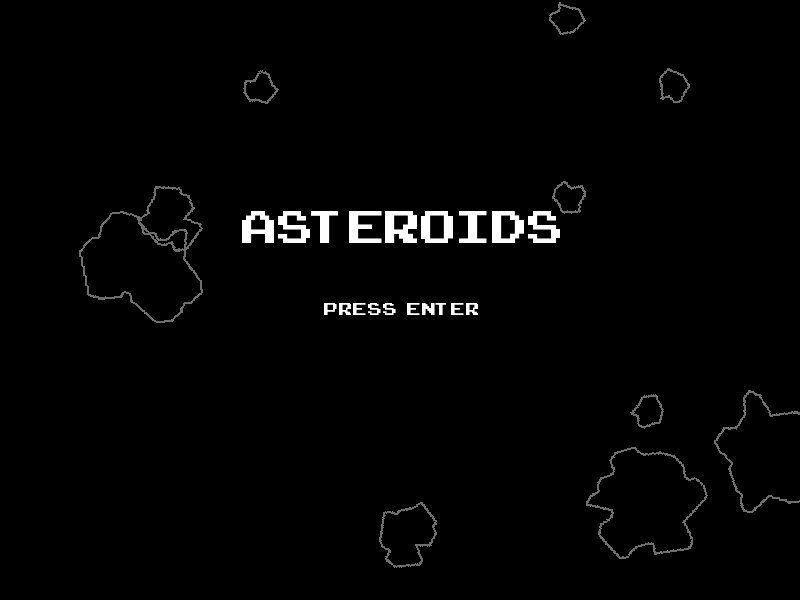
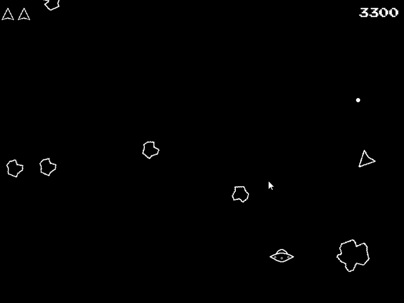

# Asteroids clone

## Overview

This is a small clone of the retro game asteroids.

I started making it with the purpose of learning to use SFML, get
comfortable writing C++ code, and managing a 'larger' project.

## Screenshots




## Dependecies

- make (mingw32-make)
- cmake

## Building

The project has included a build target in the makefile, the target uses
.bat files to build and move the necessary files into their respective directories,
at the moment the project can be build easily on windows using that, but on linux,
it will need manual building.

```
cd asteroids
mingw32-make install
```

After the project is built, you will just have tu run the executable.